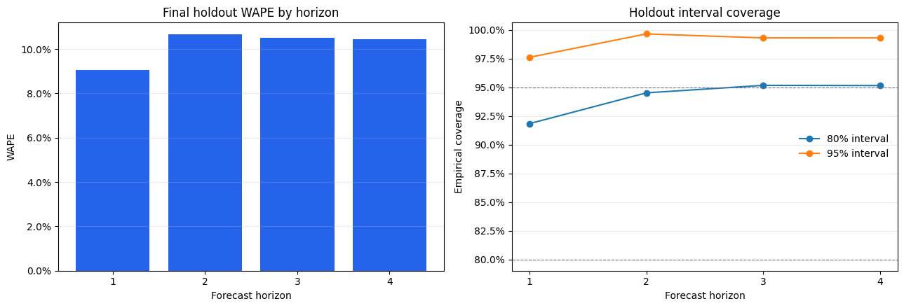
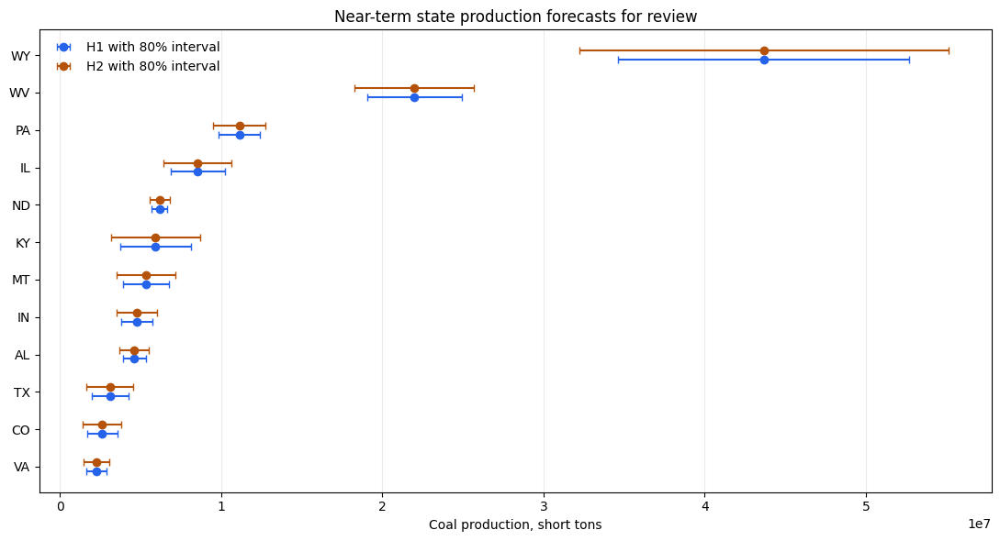

# Regional Coal Production Forecasting

[](https://github.com/ahmaddshbg-blip/regional-coal-production-forecasting/actions/workflows/tests.yml)

A reproducible forecasting portfolio project using public U.S. Mine Safety and
Health Administration (MSHA) data to estimate quarterly coal production by
state one to four quarters ahead. The intended use is prioritizing regional
capacity review for mining contractors, equipment suppliers, or industrial
service providers, not making a company-specific operating decision.

## Decision output



The final method is intentionally simple: persistence at H1, H2, and H4, and
annual seasonal naive at H3. Two regularized-regression candidates were tested
under the same chronological design and rejected before holdout because they
did not establish material, robust improvement.

Final holdout results across 12 rolling origins:

| Horizon | WAPE | Median state MASE | Aggregate signed bias | Prediction coverage |
| ---: | ---: | ---: | ---: | ---: |
| H1 | 9.04% | 0.335 | 1.04% | 100% |
| H2 | 10.66% | 0.467 | 2.21% | 100% |
| H3 | 10.50% | 0.458 | 4.18% | 100% |
| H4 | 10.46% | 0.419 | 4.17% | 100% |

The interval result is deliberately not presented as a success. Development-
calibrated 80 and 95 percent intervals achieved 94.16 and 98.97 percent pooled
holdout coverage, exceeding their predeclared upper guardrails and indicating
excessive width. They are conservative review ranges, not sharply calibrated
nominal intervals, and were not retuned after holdout.

See the [reviewed final results](docs/final_results.md) for error analysis,
uncertainty evidence, regional interpretation, and exact claim boundaries.

## Latest planning view



The latest forecast origin is `2026Q2`, with targets from `2026Q3` through
`2027Q2`. The first five H1-H2 review priorities by forecast production are
Wyoming, West Virginia, Pennsylvania, Illinois, and North Dakota.

H1 and H2 repeat the latest observed production because their frozen rule is
persistence. This ranking identifies production scale and uncertainty for
follow-up. It does not predict growth, equipment demand, staffing, service
revenue, financial impact, or causal effects. The source quarter may be revised
by MSHA.

## Why this project matters

The project demonstrates more than fitting a forecasting library:

- 2.76 million raw records are validated and reduced with DuckDB and versioned
  SQL to 183,301 mine-quarter and 2,718 state-quarter rows;
- dynamic state eligibility avoids selecting entities using future survival;
- 54 development origins, a four-origin embargo, and a 12-origin final holdout
  preserve chronological validity across H1-H4;
- target lags, labels, scaling, candidate selection, and interval calibration
  are protected by deterministic tests;
- failed Ridge candidates are documented instead of hidden or repeatedly
  replaced until one wins; and
- a durable marker and hashed manifests prevent silent final-holdout rescoring.

The result supports the portfolio claim that a simple method can be the correct
final choice when added complexity does not earn its maintenance and validity
cost.

## Data and provenance

The source is the official
[MSHA Open Government Data portal](https://arlweb.msha.gov/OpenGovernmentData/OGIMSHA.asp).
The frozen 2026-09-20 snapshot contains quarterly production records from
`2000Q1` through `2026Q2` and a mine master joined by `MINE_ID`.

Raw archives and generated checkpoints are excluded from Git because of their
size. Expected filenames, sizes, SHA-256 hashes, source counts, parsing rules,
and acquisition date are recorded in `configs/project.json` and the
[data decision record](docs/data_decision.md). Source limitations, revision
behavior, and null/zero semantics are documented in
[data provenance](docs/data_provenance.md), the
[data-quality policy](docs/data_quality_policy.md), and the
[data dictionary](docs/data_dictionary.md).

## Reproduce

The public test path does not require raw data:

```text
python -m pip install -r requirements-lock.txt
python -m pip install scikit-learn==1.9.1
python -m pip install -e . --no-deps
python -m unittest discover -s tests -v
```

For a full data rebuild, manually obtain `MinesProdQuarterly.zip` and
`Mines.zip` from MSHA, extract `MinesProdQuarterly.txt` and `Mines.txt` under
`data/raw/`, verify that their hashes match the frozen configuration, then run:

```text
python scripts/build_dataset.py
python scripts/evaluate_baselines.py
python scripts/evaluate_candidate_selection.py --candidate-config configs/candidate.json
python scripts/evaluate_candidate_selection.py --candidate-config configs/candidate_v2.json
```

Notebook 05's one-time final holdout should not be reopened merely to reproduce
a published number. The reviewed run is recorded by ID, code revision,
configuration hashes, artifact hashes, and the executed-notebook hash in the
[final results](docs/final_results.md). See the
[reproducibility guide](docs/reproducibility.md) for the public, private-Drive,
and revised-source boundaries.

## Repository guide

- `notebooks/`: five clean Colab analytical interfaces;
- `src/coal_forecasting/`: tested data, EDA, forecasting, diagnostics, and
  holdout logic;
- `sql/`: versioned mine-quarter and state-quarter transformations;
- `configs/`: frozen source, evaluation, candidate, and final-method contracts;
- `tests/`: synthetic checks for parsing, temporal boundaries, leakage,
  metrics, candidate behavior, intervals, and one-time holdout access;
- `docs/`: provenance, methodology, decisions, final results, and workflow;
- `reports/figures/`: reviewed lightweight visual evidence; and
- `scripts/`: command-line entry points for each reproducible stage.

## Limits

This is a latest-vintage chronological evaluation, not a true historical-
vintage simulation, because MSHA does not provide every prior publication
vintage. State is a regional aggregation, not a spatial model. Current mine
status and ownership fields are not treated as historically available. The
project does not estimate mine schedules, fleet needs, labor requirements,
maintenance demand, costs, prices, revenue, or causal effects.

## License and attribution

Project code and documentation are released under the [MIT License](LICENSE).
MSHA and U.S. Department of Labor data attribution and reuse boundaries are
documented in [DATA_ATTRIBUTION.md](DATA_ATTRIBUTION.md).
