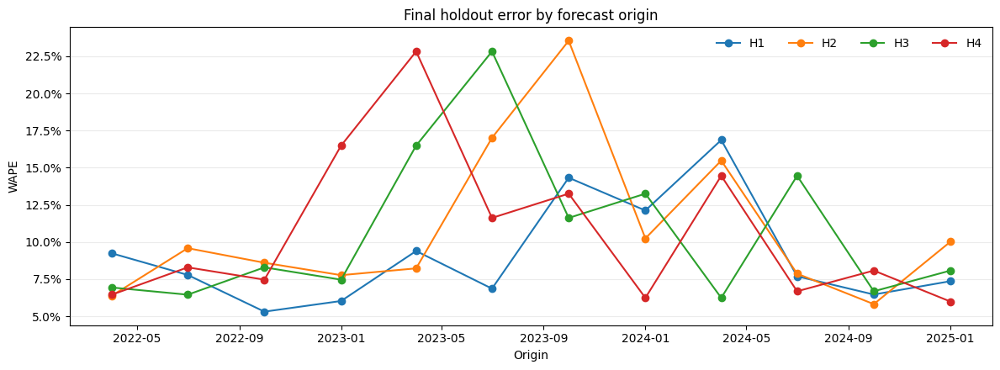

# Final Forecast Results

Status: Accepted from the reviewed Colab execution on 2026-09-23

Decision record: `DEC-019`

## Reproduction evidence

The reviewed executed notebook completed every cell without an error and ran
all 54 tests successfully. It used:

- code revision `8c9ab4d8aefc45d45ce63b3b2cbb528b54038054`;
- final run `20260923T152725Z_8c9ab4d8_e93091`;
- data run `20260921T130122Z_770aedae_bbefbe`;
- baseline run `20260921T144811Z_62a3b84d_41560a`; and
- snapshot `20260920_1b3a8424_38776a23`.

The manifest reports a clean Git worktree, `holdout_opened = true`,
`candidate_confirmation_opened = false`, and unscored latest-origin forecasts.
The displayed access mode was `reuse`, which means the one-time run had already
passed and the runner revalidated its matching marker, manifest, lineage, and
artifact hashes instead of rescoring the holdout.

The locally reviewed executed notebook contains no error output, has SHA-256
`7b2c546464c98119c8c0ffb3609f01d465ec39116389513d3502442c0f1ba81d`,
and is retained outside Git because its embedded outputs are reproducible from
the private Drive run artifacts.

## Final holdout point performance

The final holdout contains 12 origins from `2022Q2` through `2025Q1`. Positive
bias means the forecast exceeded the observed production total.

| Horizon | Forecast rows | Scored cells | Prediction coverage | Target availability | WAPE | Median state MASE | Aggregate signed bias |
| ---: | ---: | ---: | ---: | ---: | ---: | ---: | ---: |
| H1 | 296 | 294 | 100.0% | 99.3% | 9.04% | 0.335 | 1.04% |
| H2 | 296 | 292 | 100.0% | 98.6% | 10.66% | 0.467 | 2.21% |
| H3 | 296 | 290 | 100.0% | 98.0% | 10.50% | 0.458 | 4.18% |
| H4 | 296 | 289 | 100.0% | 97.6% | 10.46% | 0.419 | 4.17% |

Equal-weight mean horizon WAPE is 10.17 percent. H1 is the most accurate
operating horizon. H2 through H4 cluster near 10.5 percent rather than showing
monotonic deterioration, but their positive aggregate bias is larger. Missing
actual targets explain the decline in target availability; every eligible cell
still received a forecast.

Origin-level WAPE is not constant. Several H2-H4 origins exceed 20 percent even
though the horizon averages remain close to 10 percent, so users should monitor
individual forecast vintages rather than treating the aggregate metric as a
guarantee for every quarter.

The point results are similar to or better than the development evidence and
support retaining the simple rule. This is an absolute performance statement,
not evidence that a rejected Ridge candidate would have failed on holdout,
because candidate confirmation and candidate holdout evaluation remain
unopened.

## Uncertainty result

The development-calibrated intervals are conservative on the final holdout.

| Nominal level | Scope | Empirical coverage | Mean width, short tons | Predeclared guardrail | Result |
| ---: | --- | ---: | ---: | --- | --- |
| 80% | Pooled | 94.16% | 2,834,089 | 75%-85% | Failed high |
| 95% | Pooled | 98.97% | 5,354,653 | 90%-98% | Failed high |

At the 80 percent level, horizon coverage ranges from 91.84 to 95.17 percent.
At the 95 percent level, it ranges from 97.62 to 99.66 percent. High coverage
does not make these intervals superior: it is achieved with excessive width,
especially relative to low-volume and zero-production observations. The
intervals can be presented as conservative review ranges, but not as sharply
calibrated nominal uncertainty. They must not be retuned after this result.

## Regional evidence

For H1, the largest observed-volume states show materially different error:
Wyoming 9.60 percent WAPE, West Virginia 3.87 percent, Pennsylvania 6.89
percent, and Illinois 13.65 percent. North Dakota and Texas have H1 WAPE of
13.36 and 14.09 percent. Oklahoma's 80.48 percent H1 WAPE is attached to only
3,268 observed tons and seven scored cells, so it is not comparable in
commercial importance with the high-volume states. WAPE is undefined for
state-horizon groups with zero total actual production.

The latest-origin H1-H2 review ranking begins with:

| Rank | State | H1 forecast | H1 80% interval | H2 forecast | H2 80% interval |
| ---: | --- | ---: | --- | ---: | --- |
| 1 | WY | 43,677,063 | 34,642,753-52,711,373 | 43,677,063 | 32,227,819-55,126,307 |
| 2 | WV | 21,984,282 | 19,049,395-24,919,169 | 21,984,282 | 18,264,879-25,703,685 |
| 3 | PA | 11,135,902 | 9,843,400-12,428,404 | 11,135,902 | 9,497,905-12,773,899 |
| 4 | IL | 8,538,477 | 6,859,142-10,217,812 | 8,538,477 | 6,410,244-10,666,710 |
| 5 | ND | 6,172,564 | 5,678,420-6,666,708 | 6,172,564 | 5,546,331-6,798,797 |

H1 and H2 repeat the `2026Q2` value because their frozen rule is persistence.
The ranking therefore identifies production scale and uncertainty requiring
review; it is not a claim of growth, decline, direct equipment demand,
workforce need, service revenue, or causal impact.

## Final claim boundary

The project demonstrates a reproducible latest-vintage state-quarter forecast
with chronological evaluation, dynamic eligibility, complete prediction
coverage, immutable holdout governance, and explicit uncertainty failure
reporting. The latest forecast covers `2026Q3` through `2027Q2`; source quarter
`2026Q2` may be revised by MSHA.

Operational use still requires current mine plans, contracts, fleet and parts
data, workforce availability, maintenance schedules, commodity conditions,
and costs. No model, interval, threshold, state ranking, or narrative may be
retuned in response to these final holdout results.
